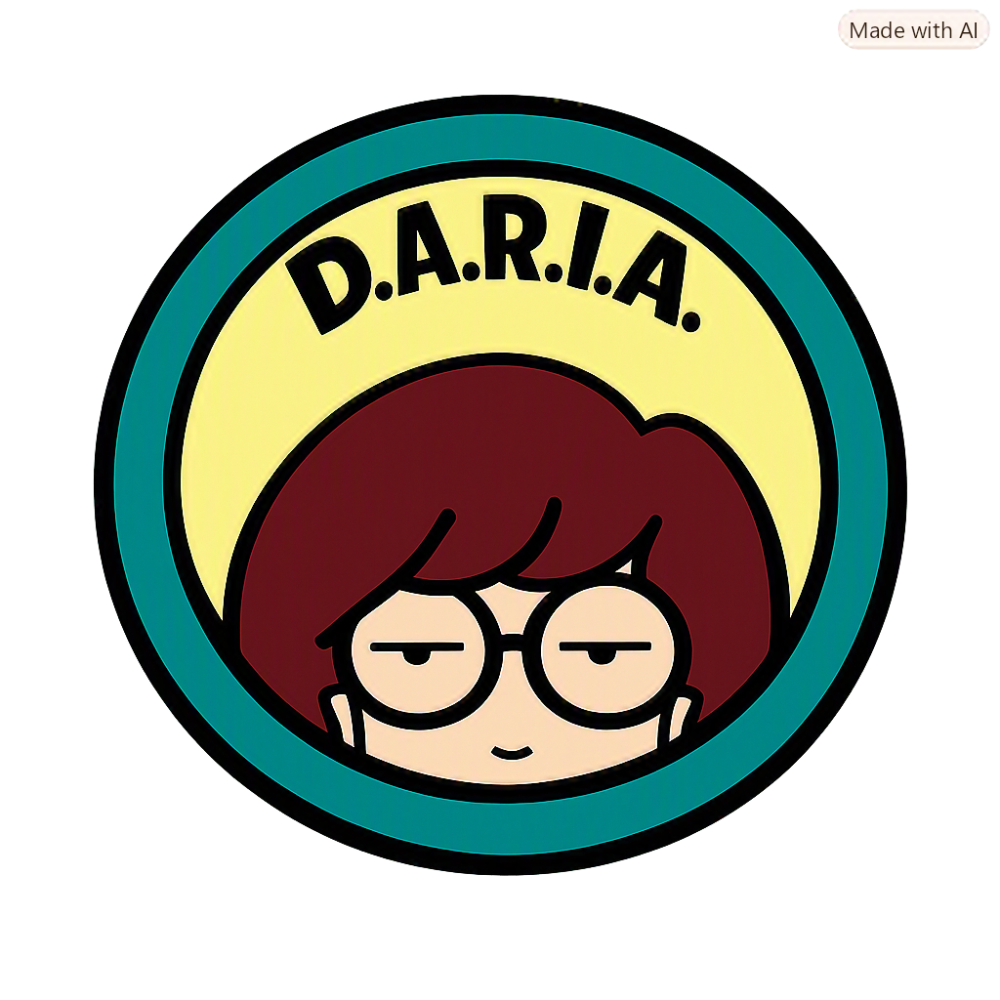

<div align="center">



# D.A.R.I.A.

### Discrete AI for Reasoning, Interaction &amp; Automation

Private, on-device AI — your models, your data, your machine.
DARIA runs open LLMs **100% offline** in a polished desktop app.
No account, no cloud, no telemetry — with a local coding agent, a document
knowledge base, Deep Research, and hands-free voice built right in.

The name is an acronym for **Discrete AI for Reasoning, Interaction &amp; Automation**:
discrete as in local, contained, and not phoned home.

[](../../releases/latest)
[](../../releases)
[](../../actions)
[](../../releases)
[](../../releases)
[](#)
[](#architecture)
[](LICENSE)

[**↓ Download**](../../releases)

DARIA is originally based on [Chaty](https://chaty.ca/) by [Fangyuan Lin](https://github.com/Fangyuan025/Chaty).

<br />

<sub>A local coding agent — searches GitHub, reads the source, edits your files, and runs the tests. **All on your machine.**</sub>

</div>

---

## Why DARIA

- 🔒 **Truly private** — every model, document, and conversation stays on your device. No sign-up, no server, nothing phoned home.
- ⚡ **Native and fast** — a Rust + llama.cpp core with **Vulkan / Metal** GPU offload that auto-tunes to your hardware and falls back gracefully to CPU.
- 🧰 **More than a chat box** — a coding agent, a knowledge base (RAG), Deep Research, on-device image generation, hands-free voice, and a self-healing Design Canvas — all offline.
- 🧠 **Runs almost anything** — Llama 3, Gemma 3 / 4, Qwen 3 / 3.5 / 3.6, *any* GGUF from Hugging Face — and **MLX models natively on Apple Silicon** — plus **DARIA's own fine-tuned model**.
- 💻 **Friendly to modest hardware** — a first-launch *“Set up for me”* picks a model sized to your RAM and downloads it in one click.

<br />

## A local coding agent

Flip the **Chat · Code** switch and DARIA becomes an agent for your codebase. Point it
at a folder, describe the task, and it explores, edits, and verifies the project by
itself — every step shown live, every change behind an approval + diff.

- 🌐 **The whole web as a tool** — key-less search of **GitHub** (repos, issues, *and code*), Reddit, YouTube, Bilibili, and any domain; fetching adapts to the content (articles → Markdown, PDFs → text, videos → transcripts).
- 🧭 **Drives a real browser** — opens pages, reads dynamic content as text, clicks and fills whole forms with real mouse events, logs in and paginates — and *looks* with the vision model when it matters.
- 🧠 **Tools that do the thinking** — `understand_repo` orients in one call, `search_code` ranks files by relevance, `read_file` lifts a single symbol plus its call sites, `validate_change` runs just the tests the change touches. Small models spend their steps on decisions, not grunt work.
- ✏️ **Precise edits, real shell** — exact-string patches behind a diff preview with a **syntax gate**, plus commands and long **background jobs** (dev servers, builds) sandboxed to the workspace.
- ⏪ **You stay in control** — per-action approval, a command allowlist, prompt-injection defense on everything it reads, and **one-click checkpoint rewind** that restores files *and* rolls back the conversation.
- 🔌 **MCP, sized for small models** — connect any Model Context Protocol server (stdio or streamable HTTP), or one-click a **curated, version-pinned store entry** that's live-certified against DARIA's own client. Tool docs are synthesized lean so a 16K context fits as many servers as you like; every result is injection-defended and untrusted servers need per-call approval.
- 📚 **Skills & project memory** — drop a `SKILL.md` of procedural steps in `~/.chaty/skills/` (or per-project) and the agent loads it only when relevant; `remember` saves non-obvious findings to `.chaty/memory/` so the next session starts knowing them. Plain markdown, human-editable, never leaves the machine.

<details>
<summary>More Code-mode details</summary>

- Reads **PDF / Word / Excel / PowerPoint** (scanned PDFs get OCR'd); `search_files` finds by name or content; file outlines navigate big files; failed patches get “did-you-mean” hints.
- Browser automation is verified end-to-end against real sites, and can run in your real Chrome — watch it work, logins and all.
- Built for local models: an **Off / Normal / Deep** reasoning switch, a **prompt-processing progress ring**, a context-usage ring with automatic compaction, whole-file reads sized to your context window, ranked `search_code` + knowledge-base `search_docs`, and loop-breaking for repetitive small models.
- Persistent sessions, project memory (**AGENTS.md**), custom **/skills**, and slash commands.
- Tune it under **Settings → Code**: step limit, command timeout, step temperature, an auto-approve-edits toggle, a headless-browser toggle, and a command allowlist.
- File access never leaves the folder you pick; out-of-workspace access asks per folder; a `sudo` command asks first with a secure password prompt; downloads land in the workspace and are covered by checkpoints too.

</details>

<br />

## Design Canvas

- **Preview | code, side by side** — every page opens as a split studio: live preview left, the **actual source** right, syntax-highlighted and palette-following. Three drag-resizable columns, fullscreen, page reload, and a **Console** tab for the page's logs and errors.
- **Point at what you mean** — Inspect links the panes both ways: hover an element and the code jumps to its line; click a code line and the element flashes. **Click to select** (⌘/Ctrl multi-select) and your next instruction edits exactly those elements — or open the source yourself with the **Edit** button.
- **Watch the edit happen** — iterations stream in Cursor-style: the code pane scans the document line by line and lands on a **Changes** diff (+N/−N, same language as Code mode).

- **Self-healing, persistent** — runtime errors offer a one-click **Fix** (always asks first); a compat layer keeps browser-clean pages clean here too (history API, cookies, clipboard); and each reply keeps its canvas session across close/reopen, with version history, a confirmed reset, and export to a standalone `.html`.

<br />

## Chat that renders everything

- A streaming, foldable **`<think>`** panel that follows the model's reasoning as it generates.
- **KaTeX** math, tables, **Mermaid** diagrams, per-block code copy, and in-app rendering of single-file HTML — including playable web games.
- A **⌘K command palette**, pinnable / renameable conversations, drag-and-drop attachments, export (Markdown / JSON), and full-text search.
- **Personalities** under Settings → Chat: Concise, Formal, Tutor, Comprehensive, Unhinged, Storyteller, and Sexy. One click fills the system prompt; click again to clear. Your own named presets still save underneath.
- Four palettes (two dark, two light) with system-theme following, native UI zoom, reduced-motion support, and an **English / 简体中文** UI. Interface strings live in `src/locales/en.json` and `src/locales/zh.json` — the app stays English unless Chinese is selected.

<br />

## DARIA can see

Load a **vision model** (its weights and `mmproj` encoder live together in one folder, paired automatically) and image understanding turns on everywhere:

- **Chat** — attach a picture and ask about it; follow-ups stay fast (already-seen images aren't re-encoded).
- **Code** — the agent reads screenshots and can look at any image with `view_image`; the composer takes images and documents just like chat.
- **Knowledge base** — imported images get a written description beside their OCR text, so search finds what's *in* them; images embedded **inside** PDFs, Word, Excel and PowerPoint files are extracted and described too.
- **Canvas** — the model sees the live rendered page when you ask for an edit.

Text-only models keep the OCR path, so nothing regresses — and updating from an older version, a one-time prompt tidies your existing loose `.gguf` files into the one-folder-per-model layout with a single click.

<br />

## Models: the store, native MLX — and DARIA's own

- A built-in **model store**: search Hugging Face by name or author, filter **GGUF / MLX**, sort by trending or downloads — then pick a **quantization** from a dropdown and hit download. Models, not file lists.
- Parameter / architecture / vision badges, the repo's README rendered in-app, and a **"fits fully in memory"** hint sized to your machine. Vision models fetch their encoder automatically; pasting a repo link still works.
- **MLX runs natively** on Apple Silicon: mlx-community folder models load through Apple's MLX stack in an isolated sidecar — same chat, vision, reasoning controls, Code agent and knowledge-base support as GGUF, and ejecting a model *always* returns its memory.
- **DARIA's own fine-tune** — a Qwen3.5-4B distilled from a much larger teacher for leaner on-device single-file web design, with a baked-in DARIA identity and grounded citations. A one-click pick in *“Set up for me”*, fully open on **[Hugging Face](https://huggingface.co/stevenpr/chaty-qwen3.5-4b-design-GGUF)**.

<br />

## A private knowledge base

- Index **PDF, Word, Excel, Markdown, ~90 text/code formats, and images** into an on-device store — one file or a whole folder. Images are read by **OCR *and*, with a vision model, described in words** so you can search what's *in* the picture.
- **Hybrid retrieval**: bge-m3 vectors + BM25 keywords, fused with RRF, de-duplicated with MMR, expanded with neighbors.
- **Strict grounding** — answers come only from your files, with **per-file citations** and hover-preview of the source passage. DARIA says when something isn't covered instead of guessing.
- **One-click report** — a cited, NotebookLM-style overview of the whole base, exportable to PDF or Markdown.

<br />

## Deep Research & the web

- Give a topic and DARIA plans queries, runs **multiple rounds** of web search interleaved with reasoning, and writes a structured, cited report — **exportable to PDF or Markdown**.
- Honest by design: the reference list contains only sources it actually cited.
- A free, key-less, multi-provider search chain (Brave → Bing → DuckDuckGo → Wikipedia) so one blocked provider never breaks search.

<br />

## On-device image generation (Apple Silicon)

Turn on **Image gen** in the chat tools menu (or `/imagegen`) and the next prompt returns a PNG — not a chat reply. Click the image to open it full-size in Preview. The **seed** is shown under the picture; click it to copy and reuse it for the next generate.

- **Z-Image-Turbo** via a local **MLX** sidecar ([mflux](https://pypi.org/project/mflux/)). Generation stays on the Mac.
- **Lazy load** — the sidecar never starts with the app. Weights load on the first generate, and turning Image gen off kills the process so the memory comes back.
- **Memory profiles** in Settings → Image gen: **4-bit** (~7 GB, 16–18 GB Macs), **8-bit** (~12 GB, the default), **full quality** (~21 GB, 40 GB+). Size, steps, and seed live there too.
- First use installs a private Python env and downloads the weights from Hugging Face. After that, generation is offline. Saved files live in the app-data **images** folder (Settings has an **Open images folder** button).
- The engine finds Homebrew / Framework Python even when the `.app` has no shell PATH (so Apple's `/usr/bin/python3` 3.9 is not mistaken for “no Python”). 3.10 through 3.14 are fine.

Apple Silicon only. Needs Python 3.10+ on the Mac for the one-time engine install.

<br />

## Hands-free voice

- **Live mode** — continuous, hands-free conversation with an animated orb. Live chat always uses **Kokoro** on-device.
- Voice in/out with silence auto-send and read-aloud. Recognition is local **Whisper**. Read-aloud can stay on **Kokoro** (offline, 11 voices + speed) or switch to **Microsoft Edge TTS** for English neural voices, with speed, pitch, and volume. Edge is online — Settings shows a privacy warning, and it is never used for live chat.
- **Deep-dive podcast** — turn your knowledge base into a NotebookLM-style two-host audio show, with WAV export.
- On-device voice runs on the **CPU**, so it never competes with the LLM for VRAM.

<br />

## Everything stays on your machine

- Conversations, models, and indexes live in one **local data folder** — copy it to back up, clear it in a click.
- **GPU acceleration**: cross-vendor **Vulkan** (Windows) and **Metal** (Apple Silicon, offload-all on unified memory), VRAM-aware auto-tuning with OOM back-off and CPU fallback.
- **Any `.gguf` — or MLX folder** — tokenizer and chat template come from the model itself; first-class handling for Llama 3, Gemma 3 / 4, and Qwen 3 / 3.5 / 3.6.
- **Adjustable context** that auto-fits the model's trained length to your memory and summarizes older turns near the limit; **safe model switching**.
- **Sampling presets** under Settings — intent starters (Thinking, Chat, Default, Fast Mode) plus family recipes for Gemma, Qwen3, and LLaMA 3. Picking one fills temperature, top-p, top-k, and repeat penalty; the sliders stay editable. Length is left alone unless you pick Fast Mode (64 tokens). Reload the model so the next reply uses the new values.

> **Offline-first.** The network is used only for optional web search, one-time model / image-engine downloads, and **Edge TTS** if you choose it for read-aloud.

<br />

## Install

Grab the latest build from the [**Releases**](../../releases) page:

| Platform | File | Notes |
|---|---|---|
| Windows x64 | `DARIA_*_x64-setup.exe` | Per-user installer — no admin required |
| macOS (Apple Silicon) | `DARIA_*_aarch64.dmg` | See the first-launch note below |

**macOS first launch.** DARIA is ad-hoc signed but not notarized (there's no paid Apple
Developer account behind it), so Gatekeeper warns on first open. The app is safe — everything
runs locally. Clear the download quarantine once:

```sh
xattr -dr com.apple.quarantine /Applications/Daria.app
```

then open DARIA normally. (Or: open it, dismiss the warning, and choose **System Settings →
Privacy & Security → Open Anyway**.) On macOS the writable models folder lives in app data —
use **Open models folder** in the model menu.

## Build

Full details in **[BUILD.md](BUILD.md)**.

```powershell
# Windows
npm install
.\dev.ps1                            # dev
npm run tauri build -- --no-bundle   # release exe → compile the Inno installer
```

```bash
# macOS (Apple Silicon)
npm install
npm run tauri dev      # dev (Metal)
npm run tauri build    # → .app + .dmg
```

Releases are produced by CI: bump with `scripts/bump-version.sh x.y.z`, then push a `vx.y.z`
tag — GitHub Actions builds both installers onto a single release.

## Architecture

| Layer | Stack |
|---|---|
| Shell | Tauri 2 — system tray, global shortcut, single-instance |
| Frontend | React 19 · Vite · react-markdown · KaTeX · UI copy in `src/locales/{en,zh}.json` |
| Inference | Rust · `llama-cpp-2` (llama.cpp) — Vulkan (Windows) / Metal (macOS) · MLX via an `mlx-swift-lm` sidecar (Apple Silicon) |
| Voice | `sherpa-rs` (ONNX Runtime, CPU) — Whisper-base.en + Kokoro-82M · optional Microsoft Edge TTS for English read-aloud |
| Knowledge base | bge-m3 embeddings + BM25 · hybrid RRF / MMR retrieval · SQLite vector store |
| Storage | SQLite — conversations, messages, full-text search |

## License

MIT — see [LICENSE](LICENSE). Built with [llama.cpp](https://github.com/ggml-org/llama.cpp), [Tauri](https://tauri.app), and [sherpa-onnx](https://github.com/k2-fsa/sherpa-onnx).
